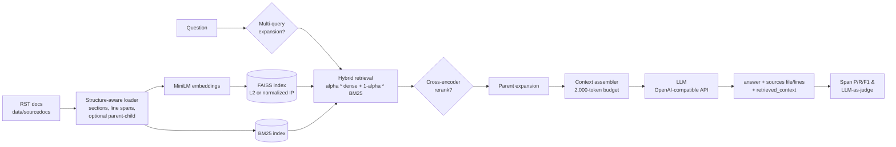

# Hybrid RAG QA

A retrieval-augmented question-answering system over the RapidFire AI documentation. It combines BM25 with dense FAISS retrieval and returns grounded answers with line-level citations, and it ships with span-level retrieval evaluation, LLM-as-judge scoring and RapidFire AI grid-search experiments.


---

## Overview

Technical documentation is a hard target for RAG. Questions mix exact API names (`List()`, `RFGridSearch`, `run_evals`), which a lexical matcher handles well, with conceptual "how does X differ from Y" phrasing, which needs semantic search. Answers are often spread across several files. And the user, or a grader, needs to see which lines of which file support each answer.

This project answers questions over the RapidFire AI open-source docs (31 reStructuredText files in `data/sourcedocs/`):

- Every answer comes back with **file + line-span citations** (`{"file": "configs.rst", "lines": [16, 51]}`) and the retrieved context used for generation.
- Context is held to a **strict 2,000-token budget**, which covers the system prompt, the sources and the question.
- Retrieval is scored with **span-overlap precision / recall / F1** against manually curated ground-truth line ranges. Answers are scored by an **LLM judge** on correctness, completeness and faithfulness.
- The retrieval stack was tuned with **RapidFire AI multi-config experiments**: the project's own pipeline was plugged into RapidFire as a custom inference engine.

## Highlights

- **Structure-aware RST ingestion** (`src/data_loader.py`). The loader detects reStructuredText headings and their underline levels, splits each document into sections, and chunks inside sections. Each chunk keeps its line span, section title and full section path. Because chunk boundaries follow the document structure, citations point at the right lines.
- **Hybrid lexical + dense retrieval, written from scratch** (`src/retriever.py`). BM25 (with tunable `k1` / `b`) is implemented directly over a custom tokenizer. It is fused with FAISS dense scores through per-query min-max normalization and a tunable weight `alpha`, over a merged candidate pool (`hybrid_candidate_k`). The pipeline also supports pure dense similarity, MMR diversification, and score-threshold retrieval with min/max bounds.
- **FAISS embedding normalization**. An optional L2-normalized inner-product index (`IndexFlatIP`), used instead of raw L2 distance. In the development ablation below it raised retrieval F1 and MRR.
- **Parent-child chunking**. Small child chunks are indexed for precise matching. Their larger parent sections (up to `--parent-max-tokens`) are what goes to the LLM. Child spans are still reported as the citations.
- **Two-stage retrieval with cross-encoder reranking**. A wide first-stage pool (`--retrieval-pool-k`) is reranked with `cross-encoder/ms-marco-MiniLM-L-6-v2`.
- **LLM multi-query retrieval**. The generator writes complementary reformulations that keep the entities and API names. Each one is retrieved separately, and the results are deduplicated and merged by best score before reranking.
- **Token-budgeted context assembly** (`src/generator.py`). The prompt is built with metadata labels and capped at `--max-context-tokens`, counting every wrapper string.
- **Provider-agnostic generation**. Any OpenAI-compatible endpoint works (`LLM_API_BASE` / `--llm-api-base`). There is also a `mock` mode for offline runs.
- **Retrieval tracing**. Each query writes its expanded queries, scores, child spans and parent context to `logs/retrieved_chunks.jsonl`.
- **RapidFire AI integration** (`src/rapidfire_adapter.py`). `RAGInferenceEngine` subclasses RapidFire's `InferenceEngine` so that RapidFire's multi-config evals can run *this* pipeline, keeping the retrieved spans for metric computation. `rapidfire_datahub_compat.py` patches the RapidFire dispatcher so it runs behind a JupyterHub proxy. The full experiment is in [`examples/rapidfire_grid_search.ipynb`](examples/rapidfire_grid_search.ipynb): it defines the config knobs, custom span-level retrieval metrics (precision / recall / F1 / MRR), runs the multi-config evals and exports the result tables.
- **Evaluation tooling**. `evaluate_retrieval.py` computes span-based P/R/F1@k. `run_judge.py` scores answers with an LLM judge using the course-provided rubric (`src/eval_utils.py`, `data/judge_prompt.txt`).

## How it works



The default configuration, chosen from the experiments below, is: hybrid retrieval, `alpha = 0.15` (BM25-heavy), chunk size 512 / overlap 200, `top_k = 2`, a 50-candidate hybrid pool, `all-MiniLM-L6-v2` embeddings, and no reranker or multi-query.

## Results

Every number below is copied from a file in `results/`. Two question sets were used:

- **Golden QA v2** (`data/golden_qa_full_v2_clean.json`, 42 questions). Built by the team with an LLM-based synthetic QA generation pipeline, so the question/answer pairs are synthetic. Each question has ground-truth line spans (12 questions have multi-span evidence), and the questions cover factual, conceptual, procedural, comparative and multi-file types.
- **Validation set** (`data/validation-set-*.json`, 45 questions).

### Final configuration

Hybrid, alpha = 0.15, chunk 512/200, top-k 2, MiniLM, normalized FAISS embeddings. Source: `results/retrieval_experiments.txt`.

| Eval set | Retrieval F1 | Precision | Recall | Retrieval score | Generator / judge | Correctness | Completeness | Faithfulness | Overall |
|---|---|---|---|---|---|---|---|---|---|
| Golden QA v2 (42 q) | 0.7071 | 0.6667 | 0.8095 | 0.7278 | gpt-oss-120b / claude-sonnet-4-6 | 0.905 | 4.333 / 5 | 1.000 | 0.891 |
| Validation (45 q) | 0.7037 | 0.6333 | 0.8611 | 0.7327 | gpt-oss-120b / gpt-oss-120b | 0.889 | 3.667 / 5 | 0.933 | 0.784 |

### Precision/recall trade-off over `top_k` (RapidFire AI grid)

Hybrid, alpha = 0.15, chunk 512/200, no reranker, validation set (45 q). Source: `results/hybrid_reranker_gridsearch_20260508_052055.csv`.

| top_k | Precision | Recall | F1 | Hit rate | MRR |
|---|---|---|---|---|---|
| 1 | 0.7986 | 0.7517 | **0.7653** | 0.7986 | 0.7986 |
| 2 | 0.6250 | 0.8628 | 0.6991 | 0.9097 | 0.8542 |
| 3 | 0.4792 | 0.8733 | 0.5941 | 0.9097 | 0.8542 |
| 4 | 0.4253 | 0.9080 | 0.5621 | 0.9583 | 0.8663 |
| 5 | 0.3750 | 0.9444 | 0.5227 | 0.9792 | 0.8705 |

`top_k = 1` gives the best span F1, but answer quality gains from more context. On Golden QA v2 with claude-sonnet-4-6 as both generator and judge, the overall judge score was 0.833 / 0.908 / 0.942 at `top_k` = 1 / 2 / 3 (`results/generation_metrics.txt`, runs C11–C13). The shipped default of `top_k = 2` balances citation precision against answer completeness.

### Ablation: FAISS embedding normalization

Hybrid, alpha = 0.15, chunk 512/200, top-k 2, on an earlier development question set. Source: `results/retrieval_experiments.txt`.

| Setting | Precision | Recall | F1 | MRR |
|---|---|---|---|---|
| Raw L2 distance | 0.453125 | 0.6875 | 0.53125 | 0.640625 |
| L2-normalized embeddings (inner product) | 0.46875 | 0.71875 | **0.55208** | **0.65625** |

### Generator model comparison

Same retrieval configuration for every generator (retrieval F1@2 = 0.7037 where reported). Source: `results/generation_model_comparison.txt`.

| Generator | Correctness | Completeness | Faithfulness | Overall |
|---|---|---|---|---|
| claude-sonnet-4-6 | 0.889 | 4.044 / 5 | 0.978 | **0.844** |
| moonshotai.kimi-k2.5 | 0.867 | 3.889 / 5 | 0.956 | 0.816 |
| api-gpt-oss-120b | 0.889 | 3.733 / 5 | 0.978 | 0.800 |
| us.amazon.nova-2-lite-v1:0 | 0.844 | 3.778 / 5 | 0.956 | 0.797 |
| minimax.minimax-m2 | 0.689 | 2.467 / 5 | 0.711 | 0.552 |
| api-gemma-4-26b (1 judge failure) | 0.422 | 1.067 / 5 | 0.400 | 0.270 |

More results:

- `results/hybrid_reranker_gridsearch_*.csv` and `results/rapidfire_run_*_metrics.csv`: the full RapidFire AI grid-search logs (one file per experiment run), covering chunking, `alpha`, pool sizes, reranking and generator choice.
- `results/generation_metrics.txt`: LLM-judge scores for 10 configurations on each question set.
- `results/experiments_log_05042026.txt`: early baseline runs.

`results/commands_used.txt` and the other notes record the commands as they were run during development, before some CLI flags and scripts were renamed (`--corpus` became `--corpus-dir`, `--llm-model` became `--generation-model`, `eval_retrieval.py` became `evaluate_retrieval.py`, `eval_generation.py` became `run_judge.py`). Use the commands in [Getting started](#getting-started) instead.

## Tech stack

Python 3.10+ · FAISS · sentence-transformers (MiniLM / MPNet embeddings, MS MARCO cross-encoder) · LangChain core/community · NumPy · OpenAI Python SDK (any OpenAI-compatible endpoint) · RapidFire AI (multi-config experiment orchestration) · pandas.

## Repository structure

```text
.
├── main.py                     # CLI: build index, answer questions, write JSON with sources
├── evaluate_retrieval.py       # Span-overlap Precision/Recall/F1@k
├── run_judge.py                # LLM-as-judge generation evaluation
├── grid_search.sh              # Small shell grid over chunk size / top-k / retriever / reranker
├── rapidfire_datahub_compat.py # RapidFire AI dispatcher patch for JupyterHub
├── src/
│   ├── config.py               # RAGConfig: every retrieval/generation knob
│   ├── data_loader.py          # RST section parsing, line-span chunking, parent-child chunks
│   ├── embedding.py            # sentence-transformers embedding wrapper
│   ├── retriever.py            # FAISS, MMR, BM25, hybrid fusion, thresholds
│   ├── generator.py            # Token-budgeted context assembly, LLM calls, multi-query
│   ├── rag_pipeline.py         # Orchestration, reranking, multi-query merge, retrieval logs
│   ├── rapidfire_adapter.py    # RapidFire AI InferenceEngine wrapping RAGPipeline
│   ├── eval_utils.py           # Course-provided metric + judge utilities
│   └── utils.py
├── data/
│   ├── sourcedocs/             # RapidFire AI documentation corpus (third-party, see License)
│   ├── golden_qa_full_v2_clean.json        # 42-q golden QA (answers + source spans)
│   ├── golden_qa_validation_v2_clean.json  # same 42 q, sources only
│   ├── validation-set-*.json               # 45-q validation set (+ question-type distribution)
│   ├── judge_prompt.txt                    # LLM-judge rubric
│   └── output.json, results_C4_v2.json     # sample pipeline outputs
├── results/                    # Experiment notes, RapidFire grid CSVs, judge scores
├── examples/rapidfire_grid_search.ipynb  # RapidFire AI multi-config grid search over this pipeline (custom metrics)
├── examples/demo-rag-baseline.ipynb  # RapidFire AI RAG tutorial notebook (SciFact), kept for reference
└── reference/                  # Reference copy of the DataHub compatibility helper
```

## Getting started

```bash
git clone https://github.com/sergimarsol/Hybrid-RAG-QA.git
cd Hybrid-RAG-QA
python -m venv .venv && source .venv/bin/activate
pip install -r requirements.txt
```

Configure an OpenAI-compatible LLM endpoint. `main.py` reads the key from a text file passed with `--apikey-txt`:

```bash
export LLM_API_BASE="https://api.openai.com/v1"   # or any OpenAI-compatible gateway
echo "sk-..." > ~/api-key.txt                     # keep this file out of the repo
```

**Answer questions** with the default (best) configuration:

```bash
python main.py \
  --input data/golden_qa_full_v2_clean.json \
  --output outputs/golden_results.json \
  --corpus-dir data/sourcedocs \
  --apikey-txt ~/api-key.txt \
  --generation-model <model-id> \
  --normalize-embeddings-for-faiss
```

The input is a JSON list of `{"question_id", "question"}` objects. Extra keys are ignored, so the golden QA file can be passed directly. To check retrieval offline without any LLM calls, use `--generation-model mock` (the `--apikey-txt` file must still exist).

**Try other retrieval strategies:**

```bash
# Two-stage retrieval with cross-encoder reranking
python main.py ... --use-reranker --retrieval-pool-k 30

# Parent-child chunking (index children, feed parents to the LLM)
python main.py ... --use-parent-child-chunking --parent-max-tokens 1000

# LLM multi-query retrieval
python main.py ... --use-multi-query-retrieval --multi-query-count 3

# Pure dense or MMR retrieval, different hybrid weighting
python main.py ... --retriever-type mmr
python main.py ... --retriever-type hybrid --hybrid-alpha 0.5 --hybrid-candidate-k 50
```

| Option | Default | Description |
|---|---|---|
| `--retriever-type` | `hybrid` | `similarity`, `mmr` or `hybrid` |
| `--top-k` | 2 | Number of chunks returned |
| `--chunk-size` / `--chunk-overlap` | 512 / 200 | Child chunk size and overlap (approx. tokens) |
| `--hybrid-alpha` | 0.15 | Dense weight in hybrid fusion (0 = BM25 only, 1 = dense only) |
| `--hybrid-candidate-k` | 50 | Merged dense + BM25 candidate pool |
| `--bm25-k1` / `--bm25-b` | 1.5 / 0.75 | BM25 parameters |
| `--embedding-model` | `sentence-transformers/all-MiniLM-L6-v2` | Embedding model |
| `--normalize-embeddings-for-faiss` | off | L2-normalize embeddings (inner-product search) |
| `--use-reranker` / `--reranker-model` | off / `cross-encoder/ms-marco-MiniLM-L-6-v2` | Cross-encoder reranking |
| `--retrieval-pool-k` | 30 | First-stage pool size when reranking |
| `--use-parent-child-chunking` / `--parent-max-tokens` | off / 1000 | Hierarchical chunking |
| `--use-multi-query-retrieval` / `--multi-query-count` | off / 1 | LLM query expansion |
| `--use-retrieval-threshold` + `--retrieval-score-threshold`, `--min-retrieved`, `--max-retrieved` | off | Score-threshold retrieval |
| `--max-context-tokens` | 2000 | Total prompt budget |
| `--llm-api-base` | `$LLM_API_BASE` | OpenAI-compatible endpoint |
| `--config` | none | Load all settings from a JSON config |

**Evaluate retrieval** (span-overlap P/R/F1@k):

```bash
python evaluate_retrieval.py \
  --output outputs/golden_results.json \
  --validation data/golden_qa_full_v2_clean.json \
  --k 2 > outputs/retrieval_eval.json
```

**Evaluate generation** with an LLM judge. The judge key is read from `OPENAI_API_KEY` / `JUDGE_API_KEY` or `~/api-key.txt`:

```bash
python run_judge.py \
  --golden data/golden_qa_full_v2_clean.json \
  --generated outputs/golden_results.json \
  --output outputs/generation_eval.json \
  --judge-model <judge-model-id> \
  --judge-base-url "$LLM_API_BASE"
```

`grid_search.sh` runs a small 16-run sweep (chunk size × top-k × retriever × reranker) end to end on the first 10 golden questions. It honours `LLM_API_BASE` and `APIKEY_TXT`.

### Reproduce the RapidFire AI grid search

```bash
pip install rapidfireai            # optional dependency, see requirements.txt
export LLM_API_BASE=...            # any OpenAI-compatible endpoint
export LLM_API_KEY=...
jupyter notebook examples/rapidfire_grid_search.ipynb
```

Edit `experiment_settings` in the "Define Multi-Config Knobs" cell to change the grid (the committed version sweeps `top_k` from 1 to 5 on the hybrid retriever).

## Team & acknowledgements

Team course project for **UCSD CSE 234 (Data Systems for Machine Learning), Spring 2026**.

- **Sergi Marsol**: built the initial end-to-end RAG pipeline (loader, embeddings, FAISS retriever, generator, orchestration, CLI) and owned retrieval engineering. That covered the structure-aware RST chunking rewrite, hybrid BM25 + dense retrieval, FAISS normalization, parent-child chunking, wide-pool retrieval and reranking experiments, and multi-query retrieval. He also built the RapidFire AI integration (custom `InferenceEngine` adapter, DataHub compatibility patch, experiment notebooks) and ran most of the RapidFire grid searches that set the final default configuration. He integrated the course evaluation module and the evaluator refactors.
- **Lillian Liu** ([@lillianyl](https://github.com/lillianyl)): LLM API integration and CLI flags, the LLM-as-judge evaluator, the initial cross-encoder reranking, the golden QA dataset (synthetic generation plus manual curation), embedding-model experiments, and the generation-quality and generator-model comparisons.

Thanks to the RapidFire AI team for the open-source library and documentation, and to the CSE 234 course staff for the evaluation rubric and utilities (`src/eval_utils.py`, `data/judge_prompt.txt`).

## License

The code is released under the [MIT License](LICENSE) © 2026 Sergi Marsol and contributors.

The documentation corpus in `data/sourcedocs/` (text and images) is third-party content authored by **RapidFire AI** ([github.com/RapidFireAI/rapidfireai](https://github.com/RapidFireAI/rapidfireai)). It is included only as a retrieval corpus, keeps its original license and copyright, and is **not** covered by this repository's MIT license. The same applies to the RapidFire AI tutorial notebook that `examples/demo-rag-baseline.ipynb` is based on.
